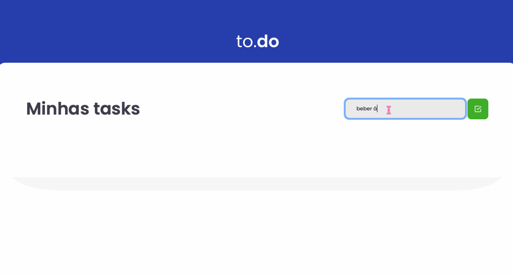

## Ignite - Desafio #1

Primeiro desafio proposto pelo Bootcamp Ignite da [Rocketseat](https://www.rocketseat.com.br/).🚀
O objetivo dessa aplicação era treinar o conceito de manipulação de estado no React.

> Aplicação de atividades a fazer, onde é possível adicionar, remover, marcar e desmarcar uma tarefa como concluída.

